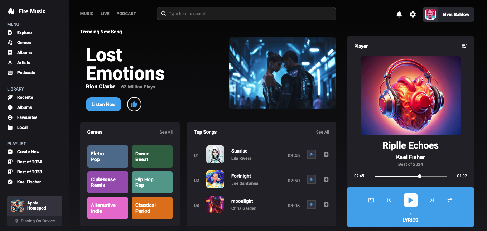

# Projeto Streaming de Música

### Projeto desenvolvido para aplicação dos estudos em HTML5, CSS3 e JAVASCRIPT. 

O objetivo era entender aplicações das linguagens de marcação com a aplicação de Javascript para construção de um layout responsivo.

